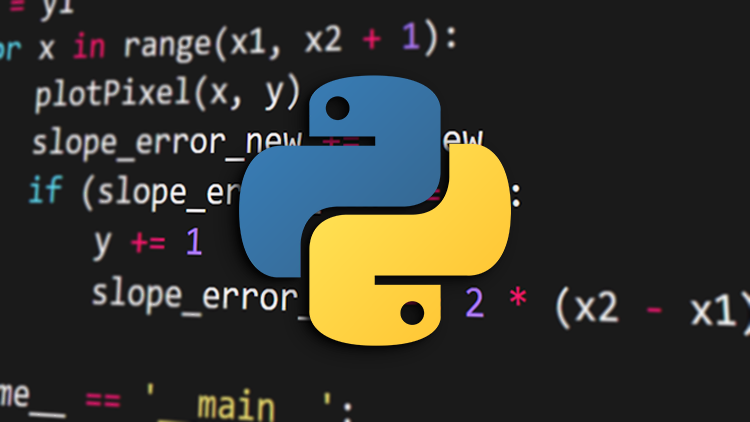

# Python Programming From Beginner to Advanced

View on [Udemy](https://www.google.com/)

**Learn Python 3 from Beginner to Advanced in an easy-to-digest and effective fashion**

Welcome, I'm glad you've found your way to this course, and I hope you will consider it in your path of learning Python and Software Development. This course is aimed at everyone who wants to learn Python, and we expect students from different levels, where if you know the basics of Python you can skip to a relevant section. This course will be as comprehensive as possible in teaching you everything you need to know about the language itself.

The course is divided into several parts. It has many sections, but they can roughly be grouped into the following parts:

1. **Python Fundamentals**. The first few sections of the course will give an introduction to Python and get you comfortable with the language and how to use it to accomplish simple things.

2. **Object-Oriented Programming**. OOP programmers are very high in demand and it's a must-learn concept if you want to work as a programmer. We will give you a good foundational understanding of Object-Oriented Programming, in Python and in general.

3. **Advanced Python**. When we have learned Object-Oriented Programming, we will cover some more advanced concepts in the Python language, such as threading, generators, regular expressions and more.

4. **Anaconda and Jupyter Notebook**. These platforms are very useful for data scientists and developers interested in machine learning.

5. **NumPy, Pandas and Matplotlib**. Finally, we will give you a good overview of the aforementioned popular data science libraries.

**Friendly course structure** - The course is set up so we will teach you simple concepts, and as we progress we will go quite thoroughly into the Python 3 language. When we have built a solid foundation for understanding the language, we will review the concepts in a more detailed fashion in the Advanced section, which will give you a solid understanding of language concepts, though it may take some time.

**Lots of additional resources** - This course provides text articles and a GitHub repository alongside the videos of the course, as well as coding challenges and quizzes to test your knowledge and solidify your understanding.

I hope I will see you in the course, and I also hope to be of utmost service to you and your programming career.

**What you’ll learn**

* Get a firm grasp of the Python language.
* Know how to solve problems using Python.
* Learn how to debug your applications and find errors in your code.
* Learn how to use packages and libraries.
* Learn the basics of Matplotlib, NumPy and Pandas.
* Apply your knowledge in your own programming projects.

**Are there any course requirements or prerequisites**

* No programming experience is required. You will learn everything you need to know as we go along.

**Who this course is for:**

* Beginner developers and people interested in learning Python from scratch.
* Software developers coming from other programming languages.
* Students of Computer Science looking for additional material on Python.