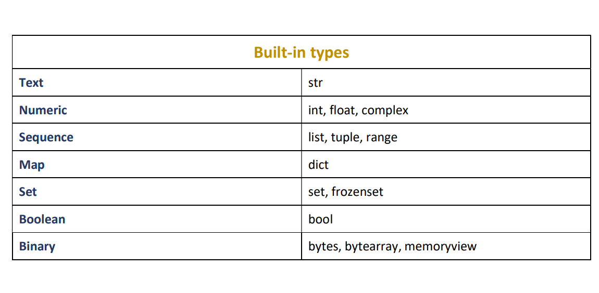

# Python Syntax Review

This article will summarize what we have learned about syntax in the section on Python Fundamentals.

## Whitespace and Indentation

When we start learning about control flow statements and functions, you will learn that we use whitespace
to delimit statements and code blocks in Python. Most programming languages ignore whitespace for the most part,
Python uses it as a fundamental part of the language itself. In Python, we use new-line characters to separate
statements of code. Here are two statements:

```python
x = 5
y = 3
```

As you can see, the statements are separated using line breaks. In C++, for example, you would use a semi-colon:

```cpp
int x = 5;
int y = 3;
```

### Code Blocks

We have not learned about If statements yet, but they essentially check some condition and run a block of statements
(a collection of statements) if the condition is true. In C++, an If statement might look like this:

```cpp
if (x > 5) {
    x += 10;
}
```

The same code in Python does not use the curly braces, instead it uses **indentation**, which can be tabs or spaces:

```python
if x > 5:
    x += 10
```

## Comments

Comments are bits of text in your code that are ignored by the compiler, and they exist to allow programmers
to document the code, or convey any kind of message to whoever happens to be reading the code. The information in
comments is lost when the program is executed. We can have **single-line comments**:

```python
# This is a single-line comments
```

You can also have **inline comments**, which follow a statement:

```python
x = 5 # This statements sets x equal to 5
```

And finally, you have docstrings, which look like this:

```python
"""
Docstring can span
multiple lines
"""
```

However, you do **not** use these like multi-line comments in other languages, these comments are specifically
made to document certain parts of your code for auto-generating documentation, for example in HTML format. Python
has no syntax for multi-line comments specifically, but you could use many single-line comments.

## Statements on multiple lines

If you have a very long statement, you might want to break it up onto more lines of code. You then use the backslash character.
Make sure, however, that you use a space before the backslash and no character should follow the backslash. Example:

```python
x = ((5 + 3) * y ** 2) + \
    ((2 + 2) * z ** 3)
```

Everything above is one statement.

## Identifiers

An identifier can begin with an underscore _ character, lowercase letters from the english alphabet from a to z, or uppercase
english letters from A to Z. **Numbers are not allowed at the start of the identifier**. The rest of the identifier can contain letters
and underscores, and also numbers from 0 to 9. Identifiers are **case-sensitive**, so the identifier Foo is not the same as foo.

## Keywords

Below is a list of keywords in Python:

```
False      class      finally    is         return
None       continue   for        lambda     try
True       def        from       nonlocal   while
and        del        global     not        with
as         elif       if         or         yield
assert     else       import     pass
break      except     in         raise
```

## Data Types

Below is a list of data types for your reference:

